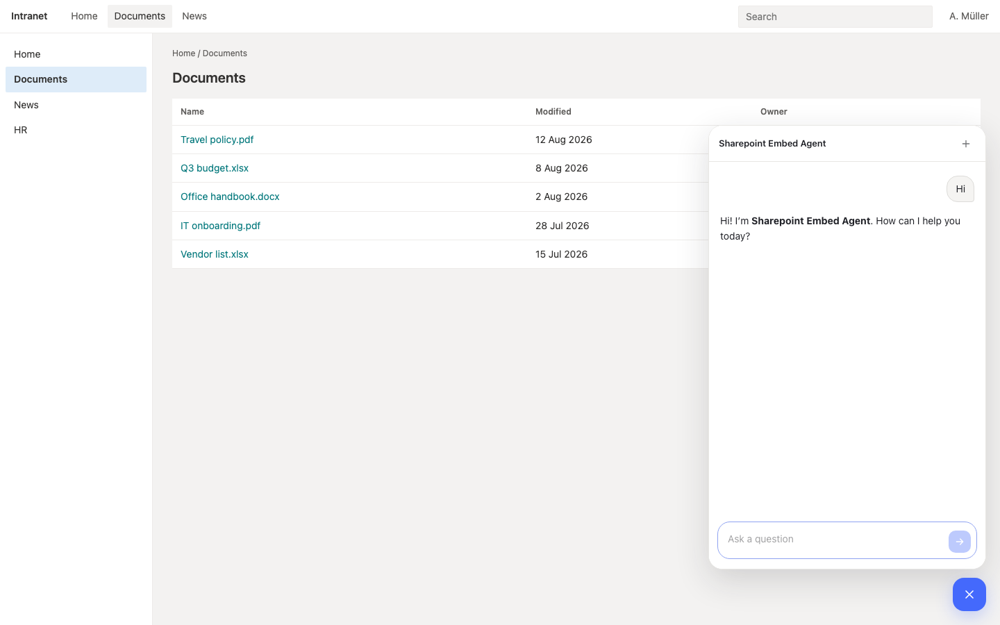

# agent-embed-iframe

A small Node server that hosts a chat widget in front of the Langdock Agent API. The browser never sees the API key, so you can iframe the widget on SharePoint or any intranet page.



## How it works

SharePoint (and most intranets) can only take an iframe or a script tag. They must not call the Agent API from the page — that would put the workspace key in the browser.

This recipe is the missing piece: a tiny trusted host. The intranet iframes **this** server; this server adds the key and forwards to Langdock.

```
Intranet / SharePoint          This server                 Langdock Agent API
    │                              │                           │
    ├─ iframe src=/ ─────────────► │                           │
    │                              │                           │
    ├─ POST /chat ───────────────► │  + API key ─────────────► │
    │  (messages only)             │  /agent/v1/chat/          │
    │                              │   completions             │
    │                              │                           │
    │  ◄── stream ─────────────────┤  ◄── stream ──────────────┤
```

`GET /config` loads the agent name from `GET /agent/v1/get` so the widget header matches the agent you pointed at.

## Prerequisites

- Node.js 18+
- pnpm
- A Langdock workspace API key with the `ASSISTANT_API` scope
- An agent in that workspace — **share the API key with the agent** (Share, top right). Chat fails until you do.

## Setup

1. Clone and install:

```bash
git clone https://github.com/niklasmeixner-langdock/langdock-cookbook.git
cd langdock-cookbook/agent-api/embed-iframe
pnpm install
```

2. Configure environment:

```bash
cp .env.example .env
# Edit .env with LANGDOCK_API_KEY and LANGDOCK_AGENT_ID
```

3. Run:

```bash
pnpm dev
```

Open [http://127.0.0.1:3333/demo.html](http://127.0.0.1:3333/demo.html) for a fake intranet with the chat bubble in the corner. The standalone widget is [http://127.0.0.1:3333/](http://127.0.0.1:3333/).

## Environment Variables

| Variable | Required | Description |
|---|---|---|
| `LANGDOCK_API_KEY` | Yes | Workspace key with `ASSISTANT_API` |
| `LANGDOCK_AGENT_ID` | Yes | Agent UUID to chat with |
| `LANGDOCK_API_BASE` | No | Default `https://api.langdock.com`. Dedicated / local: your Langdock host |
| `ALLOWED_ORIGINS` | No | CSP `frame-ancestors` allow list (comma-separated). Default `*` |
| `WIDGET_TITLE` | No | Fallback title if agent GET fails |
| `PORT` | No | Listen port (default `3333`) |

## Embed on SharePoint

Paste this into a SharePoint **Embed** web part. SharePoint requires `width` and `height` on the iframe:

```html
<iframe src="https://YOUR_HOST/" width="400" height="700"></iframe>
```

Or a corner bubble on a page that can run scripts:

```html
<script src="https://YOUR_HOST/widget.js"></script>
```

If SharePoint says the domain is not allowed:

1. Settings → **Site information** → **View all site settings**
2. **Site Collection Administration** → **HTML Field Security**
3. Add your widget host (e.g. `your-app.up.railway.app`) and save

Lock framing later with `ALLOWED_ORIGINS=https://yourtenant.sharepoint.com`.

## Endpoints

| Endpoint | Description |
|---|---|
| `GET /` | Chat widget (iframe target) |
| `GET /demo.html` | Fake intranet page with the bubble |
| `GET /widget.js` | Drop-in chat bubble for host pages |
| `GET /config` | Agent name / emoji / starters (no secrets) |
| `POST /chat` | Proxies UI messages to the Agent API |

## Making the agent aware of the page

The iframe cannot read the SharePoint page (cross-origin). For a single static page, put the URL in the agent instructions and give the agent SharePoint tools.

For more than one page, pass `?page=<sharepoint-url>` on the iframe `src` and prepend that URL as hidden context in `POST /chat`. This recipe does not do that yet — add it when one hardcoded page is not enough. A URL alone is not the page body; the agent still needs SharePoint or knowledge access to read it.
